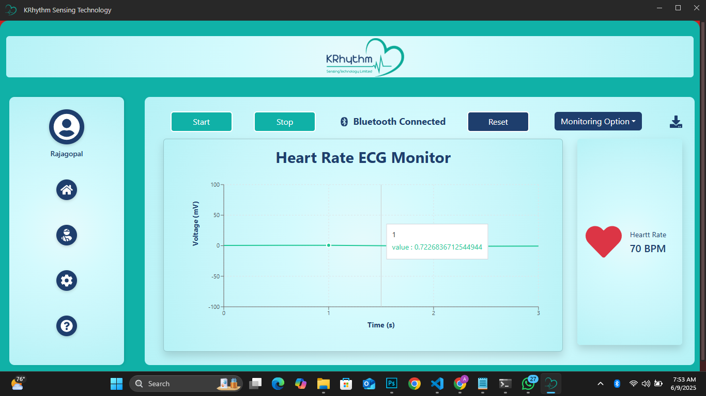

# KRhythm Sensing Technology

<br />

🩺 KRhythm Sensing Technology
The KRhythm Sensing Technology  (Health Monitoring App )is a modern desktop application built with Electron, React, and Vite, designed to display real-time or recorded health-related data such as ECG signals, heart rate, blood oxygen levels, and more.

This application is commonly used in clinical or research environments to visualize and monitor patient vitals or sensor data from external medical devices.


✨ Features

📊 Real-time graphical data display (ECG, heart rate, etc.)

📁 Offline data view & playback

🧠 User-friendly interface built with React and Bootstrap

🪟 Cross-platform desktop support using Electron

🛠️ Easily extensible for additional sensors or parameters


💡 Use Cases

Hospital monitoring stations

Home-care vitals tracking

Embedded medical device UIs

Research tools for biosignal visualization


<br />

<p align="center">
    
</p>


<br />

## Features

- 🚀 Electron - Cross-platform desktop application framework
- ⚛️ React - Component-based UI library
- 📦 TypeScript - Type-safe JavaScript for title bar
- 📦 JavaScript - JavaScript for window 
- 🎨 Bootstrap - CSS framework
- ⚡ Vite - Lightning-fast build tool
- 🪟 Custom Window & Titlebar - Professional-looking window with custom titlebar & file menus
- 📐 Clean Project Structure - Separation of main and renderer processes
- 🧩 Path Aliases – Keep your code organized
- 🛠️ Electron Builder - Configured for packaging applications

<br />


## Installation

Clone the repository and install dependencies:

```bash
# Clone the repository
git clone https://github.com/RAJAGOPAL5
cd electron-react-app

# Install dependencies

pnpm install

```

<br />

## Development

Start the development server:

```bash
npm run dev
# or
pnpm dev

```

This will start Electron with hot-reload enabled so you can see changes in real time.

<br />

## Building for Production

Build the application for your platform:

```bash
# For Windows
npm run build:win

# For macOS
npm run build:mac

# For Linux
npm run build:linux

# Unpacked for all platforms
npm run build:unpack
```

Distribution files will be located in the `dist` directory.

<br />

├── app/                        # Renderer process files ==> Inside the app for backend
│   ├── assets/                 # Static assets (images, fonts, etc)
│   ├── components/             # React components
│   │   ├── welcome/ .jsx           # Welcome kit components for window
│       └── window/  .tsx       # This for title bar
│   ├── styles/                 # CSS and Tailwind files
│   │   ├── app.css             # App stylesheet
│   │   └── window.css          # css stylesheet
│   ├── index.html              # Entry HTML file (main entry)
│   └── renderer.tsx            # Renderer process entry (main entry call renderer)
├── lib/                        # Shared library code ==> Inside the lib for backend
│   ├── main/                   # Main process code
│   │   ├── index.ts            # Main entry point for Electron
│   │   └── ...                 # Other main process modules
│   ├── preload/                # Preload scripts for IPC
│   │   ├── index.ts            # Preload script entry
│   │   └── api.ts              # Exposed API for renderer
│   ├── window/                 # Custom window implementation
├── resources/                  # Build resources
├── .eslintrc                   # ESLint configuration
├── .prettierrc                 # Prettier format configuration
├── electron-builder.yml        # Electron builder configuration (convert the app into exe)
├── electron.vite.config.ts     # Vite configuration for Electron (Bundle react + vite + electron fastly smoothyly)
├── package.json                # Project dependencies and scripts
└── tsconfig.node.json          # Main process tsconfig
└── tsconfig.web.json           # Renderer process tsconfig

<br />

